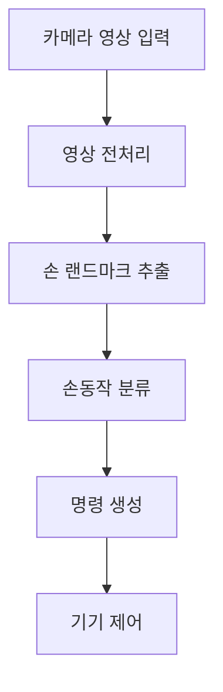

**이미지 분석과 디지털 연산을 활용한 비접촉식 손동작 제어 알고리즘 개발**
	
2026.06.13

동원동우고등학교 1학년 4반 22번 정연우
	
	
# I. Abstract - (초록)
	
	기존 접촉식 조작 방식은 감염 위험 등의 위생적 문제와 의료 현장이나 산업 현장 등에서의 사용이 취약하다는 문제점이 있다. 이에 본 연구는 이런 문제들을 보완하기 위해 아날로그 정보를 디지털 정보로 변환하는 원리와 센서들의 활용을 배우고 적용시켜 비접촉식 손동작 제어 시스템을 개발했다. 라즈베리파이를 이용해 카메라에 입력된 아날로그 영상 정보를 디지털 정보로 변환시켜 기기를 제어했다. 또한, 반도체 중 NPN 트랜지스터가 전류 증폭 및 스위칭 역할을 수행하는걸 배우고 이를 활용했다.
---
# II. Introduction - (서론)
	
## 2.1 연구 배경 및 동기 - 통합과학 교과와의 연계
	
	본 연구는 여러 문제점을 가진 기존 터치식 조작 방식을 어떻게 개선할 수 있을지 고민하다가 고등학교 통합과학 과정에서 디지털 변환, 센서의 활용, 반도체의 활용을 학습하고 이를 이용해 발명품을 제작해보고자 시작하게 되었다.
	
	카메라가 손을 감지하고 전기 신호로 바꿔 픽셀별 밝기와 색상값으로 저장되는 디지털 변환이 일어나도록 했다.
---
## 2.2 현실 문제와 연구의 필요성
	
	키오스크 등의 스마트 기기의 사용이 증가함에 따라 위생적, 상황에 따라 이용이 제한된다는 문제점이 야기되었다. 기존의 인터페이스는 직접적인 접촉이 필요해 교차 감염의 우려가 있고, 양손이 자유롭지 못한 상황에서는 조작하는데 있어 어려움을 겪었다. 따라서 신체적 접촉 없이 기기를 제어할 수 있는 비접촉 인터페이스가 필요하게 되었다고 생각했다.
---
## 2.3 시스템 구성 및 제어 원리
	
	본 시스템은 입력부인 카메라, 처리부인 라즈베리파이(소형 컴퓨터), 출력부인 트랜지스터 회로 및 LED로 구성된다. 카메라로부터 연속적인 영상이 입력되면 라즈베리파이에서 OpenCV에서 영상 전처리를 거쳐 손 모양을 인식한다. 손 모양이 감지되면 라즈베리파이의 GPIO 핀을 통해 디지털 제어 신호를 출력하고, 이 신호는 NPN 트랜지스터를 켜거나 꺼서 외부 회로의 전원을 제어한다. 트랜지스터의 베이스에 소량의 전류를 흘려주면 외부의 LED 회로에 전원이 연결되어 LED가 켜지고, 전류를 차단하면 LED가 꺼진다. 트랜지스터는 작은 베이스 전류로 외부 전원의 큰 전류를 제어할 수 있기 때문에 중간 스위치 역할을 한다. 
	

---
# III. 실험 방법 및 구현
	
## 3.1 하드웨어 구성  
	본 연구에서는 라즈베리파이와 카메라 모듈, 트랜지스터 회로를 사용하여 시스템을 구성하였다. 라즈베리파이 3B+(ARM Cortex-A53 1.2GHz, RAM 1GB, Ubuntu)와 라즈베리파이 카메라 모듈 V2(8메가픽셀, 1080p@30fps), NPN 트랜지스터(2N2222), 5mm LED(5V, 20mA), LED 전류제한용 330Ω 저항 등을 사용하였다.
	
| 부품               | 모델/사양                                     | 역할                |
| ---------------- | ----------------------------------------- | ----------------- |
| Raspberry Pi 3B+ | ARM Cortex-A53 1.2GHz, Ubuntu             | 영상 처리 및 제어        |
| 카메라 모듈           | Raspberry Pi Camera V2 (8MP, 1080p@30fps) | 손동작 영상 입력         |
| 트랜지스터            | 2N2222 (NPN)                              | GPIO 신호로 외부 회로 제어 |
| LED + 저항         | LED (빨강 5mm) + 330Ω 저항                    | 제어 결과 시각적 표시      |
	
	라즈베리파이의 GPIO 핀에서 3.3V 신호를 트랜지스터 베이스에 공급하면 트랜지스터가 포화되어 LED 회로가 연결되고, GPIO를 0V로 설정하면 트랜지스터가 차단되어 회로가 차단된다. LED는 5V 전원에 직렬로 저항이 연결된 형태로 트랜지스터 컬렉터와 접지 사이에 배치하였다. 
---
![[Pasted image 20260801141018.png]]
![[Pasted image 20260801141919.png]]
![[Pasted image 20260801142212.png]]
![[Pasted image 20260801141259.png]]![[Pasted image 20260801141513.png]]![[Pasted image 20260801141553.png]]![[Pasted image 20260801141341.png]]![[Pasted image 20260801141652.png]]`
## 3.2 소프트웨어 구현  
	이 발명에서 손 감지를 위해 MediaPipe의 손 랜드마크 추적 기능을 사용하여 손가락 관절의 현재 위치와 위치 변화를 감지하고, OpenCV 라이브러리를 사용하여 카메라로 입력되는 영상을 처리한다. 또한 데이터 처리와 연산을 위해 Numpy 라이브러리를 사용하였다. 라즈베리파이는 리눅스 우분투 환경에서 구동되며, 프로그램의 내용은 다음과 같다.
	가장 먼저 감지될 손동작의 개수를 입력받는다.
	두번째로 처음 입력된 수 만큼 사용자의 손동작과 그 손동작에 대응하는 제어를 입력 받는다.
	세번째로 카메라를 통해 사용자의 제스처를 감지한다.
	마지막으로 두가지 알고리즘 중 현재 지정되어 있는 알고리즘을 작동시킨다.
	
	첫 번째 판별 알고리즘은 구역을 나눈 후 전후를 비교해 일치도를 판별한다. 먼저 입력받는 화면을 여러 개의 사각형으로 나눈 뒤 손이 있는 영역만 남기고 각 구역의 일치도를 1로 설정한다. 다음으로 설정할 때 감지된 화면을 같은 방식으로 나눈 뒤, 현재 감지되는 화면에서 나누어진 사각형과 정보를 대조하고 손의 기울기와 손바닥 방향의 차이를 비교하여 처음 설정한 손동작의 일치도를 계산한다. 마지막으로 가장 일치도가 높은 제스처를 반환한다.
	
	두 번째 판별 알고리즘은 딥러닝 모델을 사용해 손의 관절과 마디를 분석 하고 그 일치도를 판별한다. 입력 받은 화면에서 손가락의 펴짐과 접힘 여부, 각 관절의 위치, 손바닥의 방향, 손의 기울기와 그것들의 변화를 감지한다. 또 현재 감지되는 화면에서 손가락의 펴짐과 접힘 여부, 각 관절의 위치, 손바닥의 방향, 손의 기울기와 그것들의 변화를 감지해 이전에 입력 받았던 정보와 일치도가 가장 높은 제스처를 반환한다.

![[Pasted image 20260801150926.png]]
---

## 3.3 데이터 처리 및 제어 알고리즘 흐름  
	카메라에서 입력 받은 정보에서의 노이즈를 줄이기 위해 가우시안 블러를 적용해 이미지를 부드럽게 하고 윤곽을 명확하게 했다. 다음으로 윤곽을 추적해 손의 동작 여부를 인식한다. 이런 일련의 처리를 거쳐 손동작이 감지되면 제어 신호가 발생하도록 하였다. 전체 시스템의 처리 흐름은 위의 순서도와 같다. GPIO 설정은 초당 10~15회 정도 업데이트 되며, 설정한 손동작에 알맞는 신호를 출력시킨다.
---
# IV. 실험 결과

## 4.1 실험 방법
	알고리즘 1과 알고리즘 2를 조도와 거리를 다르게 한 실험 환경에서 각각 120회 반복 실험하여 오탐률을 감지했다.
	
	조도는 맑은 날의 야외 혹은 밝은 실내에서의 조도인 약 800lx
	조금 어두운 방의 조도인 약 200lx
	빛이 거의 없는 환경인 약 5lx
	불 꺼진 환경 혹은 한밤중 야외에서의 조도인 약 0lx
	로 나누어 실험했고
	
	거리는 왜곡이 심해지고 초점 흐림 현상이 발생하는 10cm
	대부분의 카메라가 쉽게 초점을 맞출 수 있는 35cm
	손과 배경의 분리가 선명하게 나타나지 않는 75cm
	예시) 카메라 초점이 나가는 125cm
	 2초 동안 손동작을 인식시켰을 때 입력한 손동작에 대응되는 제어가 출력된다면 성공했다고 간주한다. 동작을 잘못 인식하거나 (오탐) 인식하지 못 한 경우 (미탐)는 서로를 구분하지 않았다. 실험 제스처는 주먹을 쥐었을 때, 엄지부터 약지까지 차례대로 손가락을 누적해서 폈을 때 까지 총 6개의 제스처를 사용했으며 각각 20회씩 실시하였다. 실험 결과는 소수점 둘째 자리 수 까지 반올림 했다. 

	실험은 맨손인 경우와 손의 관절과 마디를 분명하게 인식하기 힘든 우레탄 코팅 장갑(PU 코팅 장갑)을 착용하고 있는 경우를 나눠 실험을 진행했다.

---
## 4.2 장갑을 착용하지 않은 경우

	알고리즘 1
| 조도 / 거리 | 10cm | 35cm | 75cm | 125cm |
| :--- | :---: | :---: | :---: | :---: |
| **약 800lx** | 6.67% | 0% | 3.33% | 27.5% |
| **약 200lx** | 20.83% | 0.83% | 17.5% | 43.33% |
| **약 5lx** | 50% | 43.33% | 65.83% | 97.5% |
| **약 0lx** | 95.83% | 99.17% | 100% | 100% |
	
	알고리즘 2
| 조도 / 거리  | 10cm | 35cm | 75cm | 125cm |
| :--- | :---: | :---: | :---: | :---: |
| **약 800lx** | 0.83% | 0% | 0% | 1.67% |
| **약 200lx** | 3.33% | 0% | 5.83% | 8.33% |
| **약 5lx** | 28.33% | 10.83% | 30.83% | 65.83% |
| **약 0lx** | 84.17% | 85% | 99.17% | 100% |

	맨손 환경에서는 알고리즘 2가 영역 일치도를 판별하는 알고리즘 1에 비해 전반적으로 압도적인 성능을 보였다. 두 알고리즘 모두 카메라 초점이 가장 안정적인 35cm 거리와 빛이 충분한 800lx 고조도 환경에서 가장 낮은 오탐률을 기록했으나, 거리가 가깝거나 멀어질수록, 그리고 조도가 낮아질수록 오탐률이 증가하는 경향을 나타냈다. 특히 빛이 전혀 없는 환경에서는 카메라 센서의 한계로 두 알고리즘 모두 인식이 불가능했다. 다만, 알고리즘 2는 인공지능 기반의 유추 능력을 가졌기에 원거리나 저조도와 같은 악조건 속에서도 알고리즘 1보다 오탐률이 약간 낮게 측정되었다.
---
## 4.3 장갑을 착용한 경우

	알고리즘 1
| 조도 / 거리 | 10cm | 35cm | 75cm | 125cm |
| :--- | :---: | :---: | :---: | :---: |
| **약 800lx** | 8.33% | 2.5% | 5.83% | 30% |
| **약 200lx** | 16.67% | 4.17% | 20% | 45.83% |
| **약 5lx** | 45% | 37.5% | 68.33% | 98.33% |
| **약 0lx** | 96.67% | 99.17% | 100% | 100% |
	
	알고리즘 2
| 조도 / 거리  | 10cm | 35cm | 75cm | 125cm |
| :--- | :---: | :---: | :---: | :---: |
| **약 800lx** | 15% | 12.5% | 16.67% | 20.83% |
| **약 200lx** | 22.5% | 15.83% | 22.5% | 27.5% |
| **약 5lx** | 54.17% | 45.83% | 58.33% | 58.33% |
| **약 0lx** | 96.67% | 100% | 100% | 100% |

	장갑을 착용한 환경에서는 두 알고리즘의 성능이 역전되었다. 맨손 환경에서 오탐률이 거의 없었던 알고리즘 2는 장갑 착용 시 최적의 환경에서도 오탐률이 12.5%로 성능이 크게 저하되었다. 이는 알고리즘 2에 사용되는 손의 관절과 마디의 위치를 파악하는 딥러닝 모델이 마디 주름, 손톱 등 손의 시각적 특징을 중심으로 학습되어 장갑으로 인해 그런것들이 차단됨에 따라 위치 추출을 실패했기 때문이다. 반면 알고리즘 1은 손가락 마디의 디테일이 아닌 전체적인 손의 면적과 실루엣 변화를 기반으로 일치도를 판별하므로 장갑을 착용했을 때 알고리즘 2 뿐만 아니라 장갑을 착용하지 않은 경우에서의 알고리즘 1과도 별 차이가 없었다.
---
	
# V. 고찰 및 추가 탐구

	본 연구를 통해 영상 기반 비접촉식 손동작 제어가 실제로 구현 가능하며, 특히 손의 상대적 형태 정보를 이용하는 알고리즘 2가 조도와 거리 변화에 대해 더 높은 안정성을 가진다는 점을 확인할 수 있었다. 알고리즘 1은 화면을 구역별로 나누어 손의 위치와 기울기를 비교하는 방식이기 때문에 손이 카메라에 충분히 크게 잡히지 않거나 배경과의 경계가 흐려질 경우 오탐률이 증가하였다. 반면 알고리즘 2는 손바닥과 손가락 관절의 상대적인 좌표를 기반으로 판별하므로, 실제 거리 변화가 있더라도 손의 기하학적 비율이 크게 변하지 않는 범위에서는 비교적 일관된 인식 결과를 보였다. 이를 통해 손동작 인식에서는 절대적인 화면 크기보다 상대적인 관절 구조가 더 중요한 특징이 될 수 있음을 알 수 있었다.

	다만 알고리즘 2 역시 조도가 매우 낮아질수록 관절 인식이 불안정해지는 한계를 보였다. 이는 카메라 입력 영상 자체의 품질이 낮아지고, 손과 배경의 구분이 어려워지기 때문이다. 따라서 실제 환경에서 높은 정확도를 유지하기 위해서는 단순한 제스처 비교뿐 아니라, 조도에 따라 영상 보정값을 자동으로 조절하는 기능이 필요하다. 예를 들어 자동 노출, 대비 조정, 색상 보정, 배경 제거와 같은 전처리 과정을 추가하면 저조도 환경에서도 인식률을 향상시킬 수 있다.
 
	 한편, 장갑을 착용했을 때 알고리즘 2는 손가락 주름이나 음영처럼 관절 위치를 찾아낼 수 있는 시각적 단서들이 사라져 오탐률이 크게 올라갔다. 반면에 알고리즘 1은 손 관절을 일일이 따지지 않고 블러와 이진화 처리를 거친 전체 실루엣의 구역 일치도만 비교하기 때문에 훨씬 안정적이었다. 이러한 특성을 보면 우레탄 장갑뿐만 아니라 손의 전체적인 형태만 유지된다면 종류와 상관없이 비슷한 결과가 나올 것으로 보인다.
	 
	 결과적으로 키오스크를 사용할 때 등 일상생활에서는 알고리즘 2가 직관적이고 쓰기 편하겠지만, 위생이나 안전 때문에 장갑을 무조건 착용해야 하는 병원 수술실, 산업 현장, 혹은 겨울철 야외 키오스크 같은 곳에서는 가볍고 실루엣에만 의존하는 알고리즘 1을 사용하는게 더 좋은 결과를 낼 수 있다고 판단된다. 이렇게 현재 어떤 상황에서 손동작을 인식하느냐에 따라 두 알고리즘 중 하나를 선택하는 방식으로 개발하도록 판단할 수 있었다.

	또한 본 연구는 손동작을 분류하는 과정에서 정적 제스처 중심의 인식에 가까웠기 때문에, 연속적인 동작이나 속도 변화가 포함된 복합 제어에는 한계가 있었다. 예를 들어 손을 좌우로 움직이거나 손가락을 연속적으로 펼치는 동작은 단일 프레임만으로 판별하기 어렵다. 이를 보완하기 위해서는 프레임 간 변화량을 누적하여 분석하는 방식, 즉 시간 정보를 반영한 알고리즘이 추가되어야 한다. 이렇게 하면 단일 순간의 오인식을 줄이고, 더 자연스러운 제어가 가능해질 것이다.

	추가적으로, 현재 시스템은 사용자의 입력을 사용자의 손모양으로만 감지한다. 음성 인식이나 거리 센서와 결합하면 손동작만으로는 구분하기 어려운 상황에서도 더욱 정확한 제어가 가능할 것으로 예상된다.

# VI. 결론

	본 연구에서는 이미지 분석과 디지털 연산을 활용하여 비접촉식 손동작 제어 시스템을 설계하고 구현하였다. 카메라로 입력된 영상을 라즈베리파이에서 처리한 뒤 손동작을 인식하고, 그 결과를 GPIO 신호로 출력하여 트랜지스터 회로와 LED를 제어함으로써 실제 동작이 가능함을 확인하였다. 이를 통해 아날로그 영상 정보가 디지털 정보로 변환되고, 다시 전기 회로의 제어 신호로 활용될 수 있다는 점을 실험적으로 이해할 수 있었다.

	실험 결과, 손의 상대적 좌표와 관절 구조를 이용하는 알고리즘 2가 조도와 거리 변화에 대해 알고리즘 1보다 더 낮은 오탐률을 보였다. 특히 고조도와 중조도 환경에서는 높은 인식 안정성을 나타냈으며, 이는 손의 형태적 특징을 기반으로 한 판별 방식이 실용적인 비접촉 인터페이스 구현에 적합함을 보여준다. 반면 저조도 및 암흑 환경에서는 두 알고리즘 모두 성능이 급격히 저하되었으므로, 실제 적용을 위해서는 영상 보정과 환경 적응형 처리 기술이 추가되어야 한다. 또한 비록 성능은 알고리즘 2에 비해 낮았지만 인간의 맨 손을 감지하는데 특화된 알고리즘 2와는 다르게 장갑 등을 착용한 상태에서의 감지에도 장점을 보이는 알고리즘 1을 개선시켜 활용하는 방안을 모색할 수 있다. 알고리즘 1은 상대적으로 더 가볍기 때문에 사용하기 위해 방안을 찾을 가치가 충분해서 이렇게 저렇게 해야겠다.

	결과적으로 본 연구는 비접촉식 손동작 제어가 위생적이고 직관적인 차세대 인터페이스로서 충분한 가능성을 가지고 있음을 확인하였다. 또한 통합과학에서 배운 디지털 변환, 센서 활용, 반도체의 스위칭 원리가 하나의 시스템 안에서 어떻게 결합되는지 직접 경험할 수 있었다. 앞으로는 시간 정보를 반영한 동작 인식, 저조도 보정 알고리즘, 사용자 맞춤형 제어 기능을 추가하여 더욱 정밀하고 안정적인 비접촉 제어 시스템으로 발전시킬 수 있을 것이다.

	마지막으로, 본 연구는 고등학교 통합과학에서 배운 아날로그와 디지털의 변환, 센서의 역할, 반도체의 증폭 및 스위칭 원리를 실제 장치에 적용해 보았다는 점에서 의미가 있다. 카메라를 통해 들어오는 연속적인 영상 정보를 디지털 정보로 처리하고, 이를 다시 전기 신호로 바꾸어 외부 장치를 제어하는 과정은 과학 개념이 실제 기술로 연결되는 과정을 보여준다. 따라서 본 연구는 단순한 제어 장치 제작을 넘어, 과학 개념의 실용적 적용 가능성을 탐구한 사례라고 볼 수 있다.

# VII. 참고 문헌
	1. 모두의 라즈베리파이 with 파이썬 - 이시이 모루나
	2. OpenCV 4로 배우는 컴퓨터 비전과 머신 러닝 - 황선규
	3. 파이썬 3로 컴퓨터 비전 다루기 [이미지 인식, 추적, 기계 학습, 비디오 처리, 컴퓨터 비전 웹서비스] - 사우랍 카푸
	4. A. Krizhevsky, I. Sutskever, and G. E. Hinton, "ImageNet classification with deep convolutional neural networks," in _Advances in Neural Information Processing Systems_, vol. 25, 2012